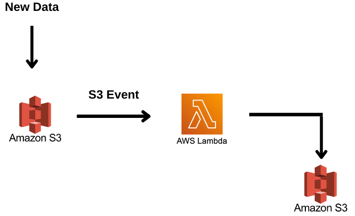
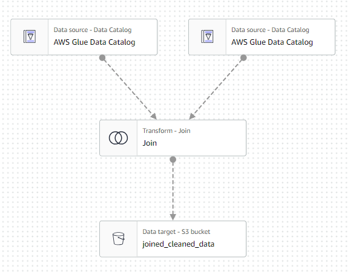
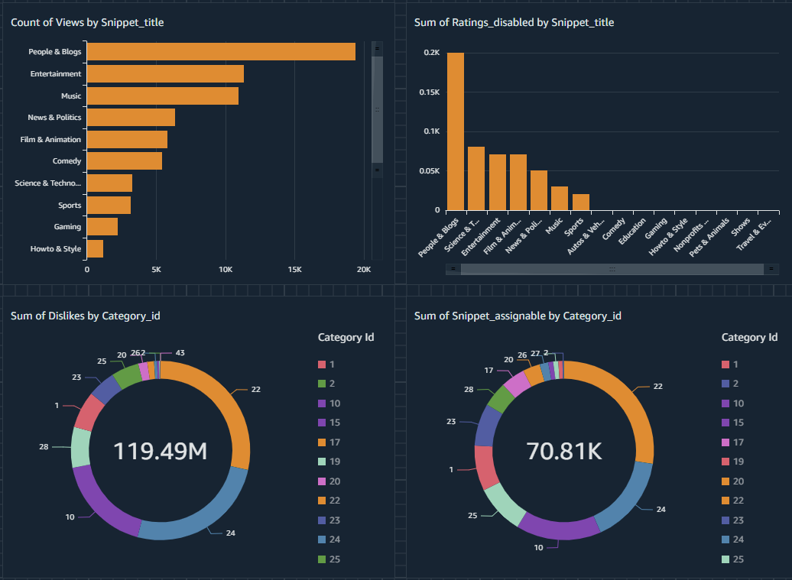

Here’s the concise rephrased version of your project, including the relevant images, ETL, and AWS mentions.

---

### YouTube Trending Video Analytics Using AWS (End-to-End)

This project leverages Amazon Web Services (AWS) to create an end-to-end analytics solution for YouTube trending videos. It covers data engineering, analysis, and reporting using services such as AWS S3, Glue, Lambda, Athena, and QuickSight.

---

### **Project Goals:**
1. **Data Ingestion**: Build a pipeline to automatically extract trending video data into AWS S3.
2. **Data Lake**: Store raw, structured, and unstructured data in AWS S3.
3. **ETL Jobs**: Use AWS Glue to automate Extract, Transform, and Load (ETL) processes.
4. **Data Analysis**: Run SQL queries on processed data using AWS Athena.
5. **Reporting**: Visualize key insights in AWS QuickSight dashboards.

### **Dataset:**
The dataset includes trending video data for regions like the US, GB, DE, CA, JP, IN, and FR. It contains columns such as video title, channel, views, likes, comments, and a separate JSON file for category information.

[Dataset link](https://www.kaggle.com/datasets/datasnaek/youtube-new)

---

### **AWS Services Used:**

1. **AWS S3**: Stores CSV and JSON data from Kaggle.
2. **AWS IAM**: Manages access and permissions for AWS services.
3. **AWS Glue**: Performs ETL tasks and manages metadata in Glue Catalog.
4. **AWS Lambda**: Processes incoming data using serverless compute.
5. **AWS Athena**: Executes SQL queries for data analysis.
6. **AWS QuickSight**: Builds dashboards for data visualization.

---

### **Implementation Steps:**

**Step 1**: Ingest data into Amazon S3 buckets from Kaggle.

  
  <h6 align="center">Source: Author</h6>

CSV and JSON files for each region are stored as S3 objects, accessible via unique S3 URIs.

**Step 2**: Create a central repository of metadata.

  
  <h6 align="center">Source: Author</h6>

AWS Glue Crawler runs through each data source, infers schema, and stores metadata in Glue Catalog.

**Step 3**: AWS Lambda processes new data and stores it in S3.

  
  <h6 align="center">Source: Author</h6>

Lambda functions process data and convert JSON to Parquet format for better performance. The Glue Catalog updates with the new schema.

**Step 4**: Create ETL jobs for data transformation.

  
  <h6 align="center">Source: Author</h6>

Glue ETL jobs automate data joining and preparation for analysis.

  
  <h6 align="center">Source: Author</h6>

**Step 5**: Create a dashboard using AWS QuickSight and Athena.

  
  <h6 align="center">Source: Author</h6>

QuickSight provides business intelligence dashboards, visualizing key insights based on the processed data.

---

This project demonstrates a scalable, serverless ETL and analytics solution using AWS services to process, analyze, and visualize YouTube trending video data.